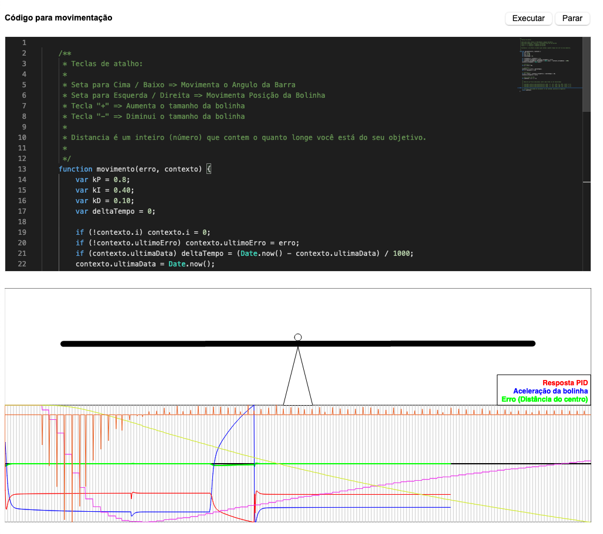

# Simulador PID

## Introdução

Este projeto é um simulador de códigos para controle de potência, com recursos gráficos, permitindo uma rápida compreensão da amplitude e frequência dos bouncings. Também permite medir rapidamente a eficácia dos algorítmos.

## Ambiente

## Modo execução

Basta clonar este projeto e abrir (dois cliques) no index.html, que todos os requisitos necessários serão carregados da internet (via CDN). Este é um projeto simples, mas muito eficaz para testes.

## Sugestções

Caso você tenha qualquer dúvida, crítica ou sugestão, fique a vontade para criar uma ISSUE, aqui no GitHub do projeto.
